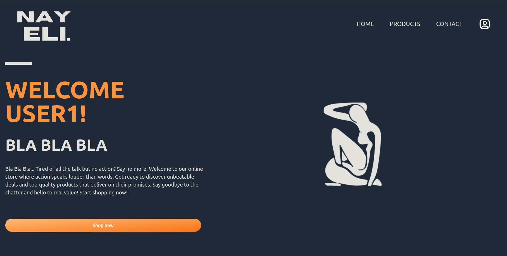

# Nayeli Online Store

Nayeli is an online store composed of two main applications: an API built with Flask and Nayeli Online Store built with Angular. This repository serves as the central hub for both components.

## Purpose

The purpose of the Nayeli project is to provide a seamless online shopping experience for users by offering access to a wide range of products at competitive prices. The project consists of the following components:

### 1. Nayeli API

The Nayeli API is built using Flask and serves as the backend for the online store. It is responsible for providing access to the Nayeli database and exposes endpoints that allow clients to retrieve information about products, categories, orders, and more.

### 2. Nayeli Online Store

The Nayeli Online Store is the frontend application built with Angular. It offers a user-friendly and intuitive interface that allows customers to browse, search for, and purchase products from Nayeli's catalog. The store showcases various screenshots demonstrating its functionality and design.

## Features

- **Comprehensive Product Catalog:** Nayeli offers a diverse range of products, ensuring there's something for everyone.
- **Competitive Pricing:** Our prices are designed to be competitive, offering customers value for their money.
- **User-Friendly Interface:** The Nayeli Online Store boasts an intuitive interface, making it easy for users of all backgrounds to navigate and make purchases.

## Screenshots

_Caption: Nayeli Online Store Homepage_

_Caption: Product Listing Page_

_Caption: Product Details Page_

_Caption: Form Contact Page_

## Getting Started

To get started with Nayeli, follow these steps:

1. Clone this repository to your local machine.
2. Set up and run the Nayeli API according to the instructions in its README.
3. Set up and run the Nayeli Online Store according to the instructions in its README.

## Contributing

Contributions to Nayeli are welcome! If you find any bugs or have suggestions for improvements, please open an issue or submit a pull request.

## License

This project is licensed under the [ Nayeli © 2024 by Ferran Piles Lablanca is licensed under CC BY-NC-ND 4.0 ](LICENSE).
